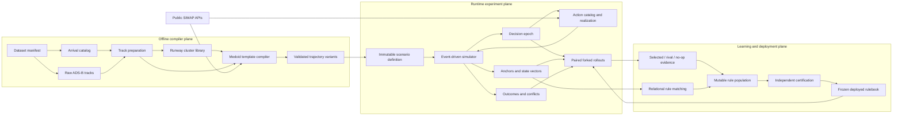

# Hailmary architecture

## 1. Purpose

Hailmary is a deterministic arrival-scenario simulator and causal rule-learning
system for tactical air-traffic interventions. It turns historical arrival
tracks into reusable trajectory templates, builds immutable multi-aircraft
scenarios, advances those scenarios through an exact event queue, compares
interventions on isolated forks, and can publish independently certified rules
as an immutable deployment policy.

The package is designed for controlled experiments. Repeating a build or a
rollout with the same inputs, configuration, seed, and policy should produce the
same artifact identities and dynamic results. The architecture therefore treats
immutability, canonical serialization, explicit randomness, and provenance as
core behavior rather than implementation details.

Hailmary does not replace the existing mutable scenario manager or SIMAP. It
owns its scenario and simulation state, calls SIMAP through a narrow adapter,
and offers a read-only compatibility view for consumers that expect an arrival
schedule.

## 2. The mental model

Think of Hailmary as three connected planes:

1. **The offline compiler plane** converts observations into validated,
   immutable artifacts. This work can be relatively expensive and includes
   clustering and physical trajectory replay.
2. **The runtime experiment plane** consumes those artifacts. Its hot loop is
   an event-driven kinematic simulator. It creates a new compiled trajectory
   only when an intervention changes a flight, then splices that trajectory
   into the affected branch without rewriting history.
3. **The learning and deployment plane** runs common-root three-arm experiments,
   updates a mutable rule population, and periodically publishes a detached,
   certified rulebook. Training, rollout continuation, and deployment share a
   hashed action vocabulary and realization runtime.



The central handoff is `TrajectoryVariant`. Offline compilation produces a
baseline variant for each cluster template. Runtime speed and path-stretch
actions produce child variants with the same contract. Consequently, the
simulator does not need separate motion logic for baseline and intervened
flights.

## 3. Architectural boundaries

The package follows a one-way dependency direction:

```text
data + geometry + configuration
        |
        v
clustering -----> templates <----- adapters/SIMAP
                         |
                         v
                   scenario model
                         |
                         v
                    simulator state
                    /      |       \
                   v       v        v
              actions   features  evaluation
                   \       |        /
                    \      v       /
                 counterfactual rollouts
                           |
                           v
                 learning + rulebook
```

The important boundaries are:

- `hailmary.data` understands source files and observation semantics.
- `hailmary.clustering` understands normalized track shape, but not runtime
  simulation.
- `hailmary.templates` defines the immutable executable trajectory contract.
- `hailmary.adapters` is the only layer that should know the details of SIMAP
  or legacy scenario-manager compatibility.
- `hailmary.scenario` defines frozen experiment inputs.
- `hailmary.simulator` owns dynamic state, time, events, lineage, and forks.
- `hailmary.actions`, `features`, and `evaluation` query or transform simulator
  state through explicit contracts.
- `hailmary.runtime` binds the action vocabulary, catalog, physical realizers,
  and an authenticated runtime-configuration hash.
- `hailmary.rollout` coordinates temporary branches and frozen continuation
  policies but does not implement aircraft motion or scoring itself.
- `hailmary.learning` owns mutable hypotheses, evidence, evolution,
  certification, immutable rulebooks, training artifacts, and Phase-0
  experiment orchestration.

Keeping these boundaries matters. In particular, adding mutable legacy objects
to the scenario definition or calling an optimizer from feature extraction
would break reproducibility and the cheap-fork model.

## 4. Core data contracts

### 4.1 Cluster library

`ClusterLibrary` is the canonical output of one airport/runway partition. It
contains:

- the local projection and feature normalization;
- the selected HDBSCAN parameters or deterministic KMeans fallback;
- canonical cluster labels and membership information;
- a medoid and acceptance radius for every cluster;
- a final assignment for every source flight, including noise fallback and
  out-of-distribution provenance; and
- the standardized training matrix required to reconstruct held-out membership
  prediction without serializing a version-bound estimator object.

The library is JSON serializable and content addressed. Its hash covers the
canonical payload, so changing data, configuration, labels, medoids, or
provenance changes its identity.

### 4.2 Cluster template and trajectory variant

`ClusterTemplate` adds operational meaning to a cluster medoid. It holds the
baseline `TrajectoryVariant`, 16 speed-action stations, 8 path-stretch stations,
cluster statistics, and provenance.

`TrajectoryVariant` is the executable flight description. It stores co-indexed,
read-only arrays for:

- station, latitude/longitude, and local east/north position;
- altitude, CAS, TAS, and ground speed;
- commanded and reference CAS plus the feasible CAS envelope;
- elapsed time at each station; and
- resource crossings and compilation diagnostics.

Its `variant_id` is derived from its complete content. Action provenance records
the parent variant and realized intervention. A runtime child is therefore an
auditable artifact, not an anonymous array mutation.

### 4.3 Scenario definition

`ScenarioDefinition` is the immutable input to a run. It freezes:

- `FlightDefinition` records and their release schedules;
- shared `ResourceDefinition` records such as runway thresholds;
- all initial trajectory variants;
- materialized exogenous events;
- weather and metadata; and
- the seed and decision-trigger event kinds.

Nested payloads are canonically serialized, trajectory arrays are copied onto
immutable byte-backed storage when necessary, and the complete definition has
a stable hash. This protects every branch from later caller mutation.

### 4.4 Simulation state

`SimulationState` is an immutable snapshot of one branch. It contains current
time, the ordered event heap, every `FlightDynamic`, materialized exogenous
state, metrics, RNG state, action log, version, and lineage identifiers.

The `Simulator` is a mutable driver only in the narrow sense that its `state`
reference advances from one immutable snapshot to the next. This gives callers
a convenient API while retaining value-like state semantics.

Two identities intentionally coexist:

- the **dynamic content hash** answers whether two states contain the same
  experiment state; and
- the **state ID** also includes provenance, so sibling forks remain distinct
  even when their initial content is identical.

### 4.5 Action runtime and learning artifacts

`ActionVocabulary` is the scenario-independent set of five supported action
identities: no-op, three speed bands, and the path-stretch macro. Its canonical
payload also records the physical speed reductions and availability limits.
`ActionRuntime` binds that vocabulary to one `ActionCatalog`, one
`PathStretchRealizer`, and one action applier. Its configuration hash is carried
through simulator snapshots and must match on resume; opaque injected validators
or selectors require an explicit fingerprint.

The learning layer deliberately separates mutable and deployable state.
`Population` contains evolving `MutableRule` hypotheses and online evidence.
`EvaluationSnapshot` contains a detached `FrozenRulebookPolicy`, publication
epoch, certification evidence, and the feature/action/configuration hashes used
to authenticate decisions. `TrainingCheckpoint` and `EpochTrace` make trainer
resume and individual experiments content-addressed and auditable.

## 5. Coordinate, station, and time conventions

These conventions are easy to misread and should be checked before changing
interpolation, action, or event code.

### 5.1 Raw and clustering order

Prepared historical tracks are oriented **upstream to threshold**. Shape
features resample that direction to a fixed station count. The terminal point
is aligned exactly to the runway threshold after ground speed is derived, so a
sparse final sample cannot create an artificial speed spike.

### 5.2 Executable variant order

Executable arrays use remaining-distance station order:

- `s_m[0] == 0` is the threshold;
- `s_m[-1]` is the upstream release point;
- `s_m` strictly increases in array order; and
- an aircraft flies from the last array element toward index zero.

`elapsed_time_s` is time since release at a station:

- `elapsed_time_s[-1] == 0` at release;
- it strictly decreases in array order; and
- `elapsed_time_s[0]` is the total duration at the threshold.

Thus physical flight progress makes `s_m` decrease while elapsed time
increases. `MonotoneTrajectory` centralizes the interpolation needed to avoid
duplicating this inversion.

### 5.3 Runtime clocks

A live flight keeps both its true release time and a trajectory-clock origin.
Normally they begin together. A live disturbance or trajectory replacement can
shift the trajectory clock without pretending the historical release happened
later. This distinction allows downstream event times to move while preserving
the causal prefix.

## 6. Offline compilation from observations

### 6.1 Resolve and load data

`DataManifest` resolves named dataset resources. `CatalogArrival` supplies the
authoritative airport, runway, callsign, aircraft identity, and time bounds.
`RawADSBTrack` loads ordered observations from CSV files.

The catalog is authoritative for the cohort. ADS-B rows outside a catalog
arrival's time window are not allowed to create a new flight.

### 6.2 Prepare the runway cohort

`prepare_adsb_tracks_for_clustering` partitions arrivals by airport/runway and
then, for each flight:

1. removes unusable or duplicate samples;
2. truncates the track at the landing endpoint;
3. reconstructs the final inbound crossing of the configured 50 NM circle;
4. projects latitude/longitude into a runway-centered local frame;
5. derives the observed release time and ground speed;
6. aligns the terminal point to the threshold; and
7. resamples the horizontal shape to the configured 128 stations.

Rejected tracks receive typed reasons. They remain part of the preparation
audit rather than silently disappearing.

### 6.3 Select clusters and medoids

The clustering layer flattens translation-normalized track shape, standardizes
the feature dimensions, and sweeps configured HDBSCAN candidates. Candidate
selection balances silhouette, persistence, coverage, and fragmentation under
explicit constraints. If no density solution is usable, deterministic KMeans
selection provides the declared fallback.

Labels are canonicalized so their numeric value does not depend on estimator
label order. Every flight receives a cluster assignment. HDBSCAN noise is
assigned to the nearest medoid and marked with its fallback/OOD provenance.
Each cluster medoid is an observed member minimizing mean station-wise distance,
not a synthetic average path.

### 6.4 Compile templates through SIMAP

`TemplateCompiler` combines the medoid's horizontal path with its altitude and
speed observations. It derives zero-wind CAS, smooths and monotonizes the
command profile, computes the A320 envelope, and selects the fixed action
stations.

`SIMAPAdapter` then reconstructs bounded commands and uses SIMAP's public
coupled replay. The replay produces the physical CAS/TAS/ground-speed,
altitude, time, path, bank-demand, cross-track, and threshold diagnostics stored
in the variant. Curvature wrap correction and persistent-overbank measurement
are local to the adapter; legacy SIMAP code is not modified.

Compilation fails explicitly when the historical reference violates the
configured envelope-correction, timing, path, bank, or threshold gates. The
system does not relax these gates to force every cluster to compile.

## 7. Scenario construction

`ScenarioGenerator` remains the generic immutable-definition builder.
`TrafficScenarioBuilder` owns the ADS-B schema-v2 boundary: half-open demand
windows, exact terminal-entry provenance, one global scale, qualified
airport/runway/cluster identities, and static `SegmentTraversalDefinition`
records. `RouteGraphArtifact` contributes the segment entry/exit resources.
There is no factorial generation or correlation gate.

## 8. Runtime event engine

### 8.1 Initial event materialization

When a `Simulator` is created, it materializes release, action-station,
resource-crossing, completion, and exogenous events. The queue is ordered by:

1. event time;
2. event-kind priority;
3. flight ID;
4. station index; and
5. insertion sequence.

Events at exactly the same time are removed as one batch and applied in this
stable order. Only after all physical events in the batch are applied can a
single decision epoch be exposed. A policy therefore sees the complete state
at that instant rather than an arbitrary intermediate ordering.

### 8.2 Flight lifecycle and sampling

A flight moves through `scheduled`, `active`, and `completed`. While active,
`Simulator.sample_flight` subtracts the trajectory-clock origin and queries a
`MonotoneTrajectory`. No integration or optimizer runs in this hot query.

Exogenous disturbances can update shared state and metrics or delay one flight.
For an active flight, only pending downstream events and the trajectory clock
move. For a scheduled flight, release and downstream events are regenerated.
Events that already occurred are never rewritten.

### 8.3 Decision epochs and freshness

An `ActionCatalog` enumerates candidates only for an active bound flight whose
action station appeared in the current batch. Every `ActionCandidate` captures
the state ID, version, epoch index, dynamic content hash, anchor, flight,
station, lever, and band.

Before realization, the candidate proves it still belongs to the current
state. Advancing the simulator, taking another action, or rebinding to a fork
without updating provenance makes an old candidate stale. This prevents a
controller from applying an action against conditions that no longer exist.

For policy-driven runs, actions pass through the simulator's configured action
applier. A non-null applier requires a runtime-configuration hash, and forks and
snapshots preserve that binding so a rollout cannot silently change physical
realization semantics.

## 9. Action realization

### 9.1 Speed actions

At a speed station, the catalog may expose light, medium, and heavy reductions.
Candidates that cannot produce the configured minimum effective reduction
because of the lower speed envelope are omitted.

`realize_speed_variant` inserts the exact anchor if needed, keeps the command at
the anchor unchanged, and applies the reduction strictly downstream. The new
command remains bounded by the envelope and never exceeds the medoid reference.
When SIMAP replay provenance is available, the child is replay-validated.

### 9.2 Path-stretch actions

At a stretch station, `PathStretchRealizer` creates smooth short, medium, and
long runway-away corridors. Geometry construction enforces forward progress,
endpoint position/tangent continuity, no fold or self-intersection, target
added distance, and medoid clearance.

The default selector evaluates all feasible variants from identical temporary
forks over one frozen semi-local horizon. No later tactical actions are allowed,
but the same materialized exogenous events remain active. The score combines
the semi-local outcome and new conflict penalties. A geometry-clearance-only
selector remains available as an ablation.

### 9.3 Causal live splice

Both levers compile a complete child variant, but an active aircraft cannot be
teleported onto a newly replayed history. `preserve_compiled_live_prefix` and
`Simulator.replace_flight_variant` therefore:

1. preserve the already-flown position, altitude, CAS, and time prefix exactly;
2. map the current parent station to the child station;
3. establish a child trajectory-clock origin that is continuous at the splice;
4. remap all pending action/resource events; and
5. leave prior events and parent/sibling branches unchanged.

Speed uses an identity station map. Stretch uses a monotone parent-to-child
arc-length map. The realized action, child ID, delay, magnitude, validator, and
oracle diagnostics are appended to the branch action log.

## 10. Features, outcomes, and rollouts

### 10.1 Anchors and state vectors

Resource predictions order active flights by ETA. Adjacent flights form stable
leader/follower anchors. The state-vector layer derives spacing deficit,
minimum reachable ETAs, speed and path delay capacity, remaining intervention
freedom, commitment, traffic pressure, and trailing-flow context under a
versioned feature schema.

Feature extraction queries current compiled trajectories and counters. It does
not run SIMAP or an action optimizer, which keeps decision-time latency bounded
and prevents hidden side effects.

### 10.2 Evaluation

The evaluation layer has three related responsibilities:

- compute required runway spacing and normalized spacing quality;
- detect continuous-time lateral/vertical conflicts between piecewise-linear
  timed trajectories; and
- score the bound leader/follower pair plus up to three frozen trailers.

The semi-local score includes pair quality, downstream propagation,
intervention cost, and throughput. The cohort and horizon are frozen from the
parent so competing branches cannot improve their score by changing which
aircraft are evaluated. A `SimulatorOutcomePlan` also freezes the root
intervention summary; rollout scoring subtracts that baseline so historical
actions do not count as costs of the current experiment.

### 10.3 Exact forks and counterfactual rollouts

`Simulator.fork` shares immutable definitions and trajectory arrays but copies
branch-local dynamic state, event queue, RNG state, metrics, lineage, and logs.
Installing a cache-miss action variant replaces only the child definition
tuple.

`paired_simulator_rollout` creates selected and contender forks, rebinds the
epoch-bound candidates to each branch's provenance ID, applies one initial
action, runs both under the same frozen policy to the same horizon, and scores
them with the same outcome plan. `three_arm_simulator_rollout` adds a mandatory
root no-op arm and returns selected-versus-rival, selected-versus-no-op,
rival-versus-no-op, and veto deltas. Held-out evaluation uses the separate
`policy_vs_permanent_no_op_simulator_rollout`, whose control remains no-op at
later epochs as well. All variants verify that the parent and policy remain
unchanged.

## 11. Learning, certification, and deployment

At a decision epoch, the trainer builds an `AnchorContext` for each current
leader/follower anchor. Rules match a role, feature-schema hash, action identity,
and axis-aligned `RuleCondition`. `cover_missing_actions` creates matching
hypotheses only for currently feasible actions, while
`RegionExplorationScheduler` distributes experiments across coarse commitment,
pressure, and error regions.

`CausalTrainer` freezes the match set and current `EvaluationSnapshot`, chooses
one root action and the strongest certified rival, and runs selected (A), rival
(B), and no-op (C) forks under the same frozen deployed continuation policy.
Only A's first action is committed to the real simulator. The resulting deltas
update separate rival-grounded evolution and no-op-grounded deployment ledgers.
Evolution is restricted to same-action niches and includes mutation, crossover,
bounded-population deletion, and conservative subsumption.

Certification is intentionally slower than population learning. Action rules
must have sufficient independent no-op-grounded evidence and a positive lower
confidence bound; no-op rules use rival-grounded evidence and publish as scoped
vetoes. Passing rules are copied into `FrozenRulebookPolicy`, which contains no
live reference to the population and performs no exploration or learning.

`Phase0ExperimentRunner` applies this loop to materially disjoint scale-one
`TrafficScenarioBatch` inputs. Complete multi-runway snapshots are simulated,
while outcome credit is restricted to the frozen bound pair. Windows without an
actionable shared segment remain in fidelity audits and receive an explicit skip
reason. Phase 1 uses the same traffic builder with one global scale and restores
downstream-trailer credit. See [the Phase-0/1 walkthrough](../phase0.md).

## 12. Reproducibility and failure behavior

Reproducibility is enforced at several levels:

- frozen configuration objects make experimental choices explicit;
- canonical JSON and read-only arrays define stable artifact content;
- IDs and hashes derive from content rather than process identity;
- cluster labels and tie breaking are canonical;
- named RNG state is stored in simulation snapshots;
- exogenous uncertainty is materialized before paired branching; and
- every action is bound to a precise decision epoch and records provenance;
- action vocabulary, physical realization, feature schema, outcome plan, and
  continuation policy are hashed at experiment boundaries; and
- published rulebooks and learning artifacts are detached, canonical, and
  content checked when deserialized.

Failures are intentionally typed and early. Invalid artifacts raise
`ArtifactValidationError`, invalid settings raise `ConfigurationError`, stale
or infeasible actions raise action errors, invalid state transitions raise
`SimulationError`, and invalid traffic/topology contracts raise explicit
validation or feasibility errors. A maintainer should preserve these fail-closed semantics
when adding a new data source, aircraft type, action lever, or feature.

## 13. Integration surfaces

The supported command-line entry points include:

```bash
hailmary-build-clusters --help
hailmary-build-templates --help
hailmary-build-offline-corpus --help
hailmary-build-route-graph --help
hailmary-visualize-route-graph --help
hailmary-build-traffic-batch --help
hailmary-simulate --help
```

The cluster CLI consumes already prepared/resampled local XY tracks. The richer
raw ADS-B path is the Python API `build_cluster_library_from_adsb`, because it
also returns preparation and rejection audits. The template CLI consumes the
cluster JSON and raw medoid profiles, then writes variant NPZ files plus a
manifest. The simulator CLI consumes a scenario-definition JSON that references
those NPZ variants and writes a deterministic trace.

`HailmaryScheduleView` is a read-only compatibility adapter for code that needs
an arrival schedule. It must not become a back door for mutable legacy state.

Learning and Phase-0 orchestration are currently Python APIs rather than
additional console scripts. Construct one `ActionRuntime` with
`build_action_runtime`, use it consistently to create/resume simulators and the
trainer, and persist learning artifacts through the typed helpers in
`hailmary.learning.artifacts`.

## 14. How to reason about changes

When modifying the module, locate the change in the artifact chain:

- A source parsing or track-preparation change invalidates cluster artifacts and
  everything downstream.
- A feature transform, cluster selection, or medoid rule invalidates cluster
  identities and templates.
- A performance model, envelope, path, or replay change invalidates variants
  and may change all event times.
- A scenario-model change affects definition hashes and snapshot compatibility.
- An event-ordering or splice change affects causal runtime behavior and fork
  equivalence.
- A feature-schema change requires a new schema version and downstream model
  retraining.
- An outcome-weight change alters comparison semantics but should not change
  physical branch evolution.
- An action-vocabulary or runtime-realization change invalidates authenticated
  snapshots, rulebooks, checkpoints, and evaluation evidence.
- A credit, evolution, certification, or rule-arbitration change alters learned
  and deployed behavior even when simulator physics is unchanged.

The focused tests in `tests/hailmary` mirror these boundaries. Add the narrowest
unit test at the changed layer and at least one end-to-end test whenever an
artifact contract or runtime handoff changes.
