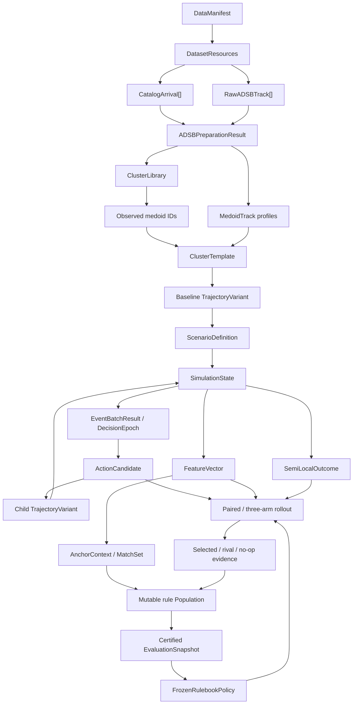
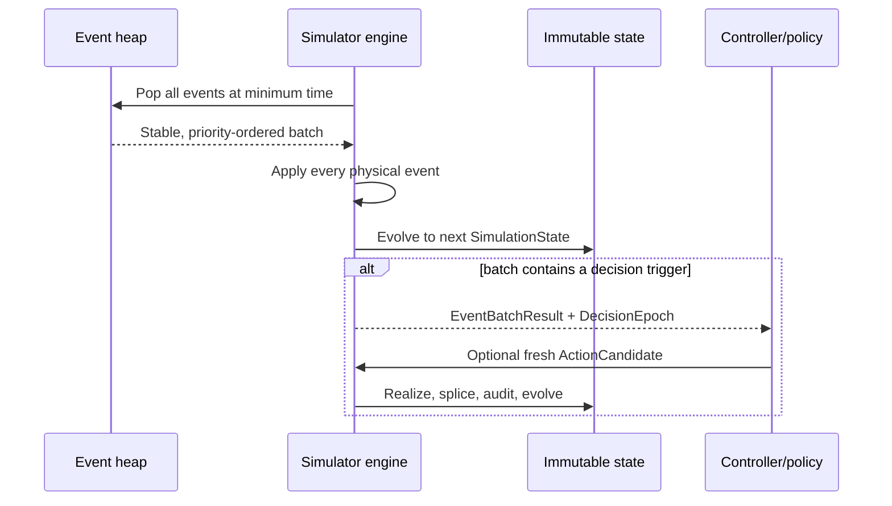

# Hailmary end-to-end data flow

## 1. Scope

This document follows data through Hailmary from historical observations to a
scored counterfactual rollout. It is written for maintainers diagnosing where a
value came from, where it is transformed, and which downstream artifacts are
affected by a change.

Hailmary has three execution modes:

- **offline preparation**, which produces cluster and trajectory artifacts;
- **runtime simulation**, which produces event traces, actions, features,
  conflicts, outcomes, and paired/three-arm rollout comparisons; and
- **learning and deployment**, which turns repeated counterfactual evidence into
  a mutable rule population and periodically publishes an immutable certified
  rulebook.

## 2. Artifact lineage at a glance



Artifact and runtime-state nodes are immutable or frozen snapshots. The two
intentional mutable coordinators are the learning `Population` and the
`Simulator`; the latter only advances its reference from one immutable
`SimulationState` to the next.

## 3. Stage A: dataset discovery

### Inputs

- manifest path;
- optional dataset ID;
- arrival catalog CSV;
- raw ADS-B CSV directory; and
- runway/airport geometry referenced by the catalog or caller.

### Processing

`load_manifest` validates the manifest. `resolve_dataset_resources` resolves
paths relative to the manifest and returns `DatasetResources`. The arrival
catalog normalizes callsigns and runway names and validates required numeric
fields. Raw CSV rows are grouped into time-ordered `RawADSBTrack` records using
a stable flight identity derived from callsign and ICAO24.

### Output and invariants

- Catalog rows define the authoritative arrival windows.
- Raw rows are observations, not independent declarations of flights.
- Paths are resolved once at the data boundary rather than scattered through
  clustering code.

## 4. Stage B: raw track preparation

The primary API is `prepare_adsb_tracks_for_clustering` in
`hailmary.clustering.pipeline`.

For each catalog arrival in the requested airport/runway partition, the
pipeline clips raw observations to the catalog interval and validates that the
track reaches the terminal area. It finds the final inbound entry into the
50 NM terminal circle, interpolating a crossing sample when the observation
interval straddles the circle. That crossing becomes the observed release.

The track is projected into a local east/north frame centered on the runway
threshold and oriented upstream-to-threshold. Neighbor duplicates are removed,
ground speed is derived from the unsnapped samples, the last point is aligned
to the threshold, and horizontal shape is resampled to 128 stations by default.

The result separates accepted and rejected data:

```text
ADSBPreparationResult
  accepted_tracks: PreparedADSBTrack[]
  rejections: TrackRejection[]
  catalog/runway/projection provenance
```

`PreparedADSBTrack` retains both clustering shape and the altitude/speed/time
source needed to reconstruct a medoid profile later. Rejection reasons are
typed so data-quality reports can distinguish missing source rows, insufficient
geometry, failure to enter the terminal area, and other causes.

## 5. Stage C: clustering and final assignment

`build_cluster_library_from_adsb` passes accepted resampled shapes to
`build_cluster_library`.

### Shape transform

`fit_shape_features` checks the common `(station, 2)` shape, removes translation
effects, flattens east/north coordinates, and standardizes every feature. The
fitted `ShapeFeatureTransform` is stored so held-out tracks use exactly the same
preprocessing.

### Model selection

`run_hdbscan_sweep` evaluates the configured combinations of minimum cluster
size, minimum samples, and selection method. The score combines silhouette,
persistence, coverage, and fragmentation, subject to maximum noise and cluster
fraction constraints. If none is acceptable, the deterministic KMeans sweep is
used.

### Canonicalization and medoids

Raw estimator labels are replaced by canonical labels ordered through stable
medoid identity. `compute_cluster_medoids` selects the observed member with the
smallest mean station-wise distance to the other members and computes a
cluster-specific acceptance radius.

### Assignment behavior

All training flights receive a `FlightAssignment`. A density-model noise point
is associated with its nearest medoid and marked as fallback/OOD as appropriate.
For new flights, `assign_new_flights_with_membership` reconstructs the selected
predictor from the persisted standardized training matrix, requests approximate
membership first, and uses nearest-medoid fallback only when required.

### Output

One `ClusterLibrary` JSON artifact is produced per airport/runway. Its content
hash changes if any transform, model-selection result, medoid, assignment,
training matrix, or configuration changes.

## 6. Stage D: medoid template compilation

The cluster library identifies the observed medoid flight for each cluster.
The corresponding `PreparedADSBTrack` is converted to a `MedoidTrack` containing
path, altitude, time, and optional observed ground speed.

`TemplateCompiler.compile` performs the following transformations:

1. project and deduplicate the path;
2. convert it to threshold-origin remaining-distance station order;
3. resample the path/profile to the dense template grid;
4. derive and robustly smooth speed;
5. convert zero-wind TAS to CAS and form a monotone command reference;
6. obtain the A320 CAS envelope;
7. reject excessive historical envelope correction;
8. select exactly 16 speed and 8 stretch stations outside the final gate;
9. call the configured validator, normally `SIMAPAdapter`; and
10. freeze the arrays, diagnostics, crossings, provenance, and content ID.

The SIMAP adapter simplifies the horizontal path to a public `ReferencePath`,
reconstructs bounded longitudinal commands, runs the public coupled replay, and
maps replay stations back to the physical release and threshold endpoints. Its
diagnostics include timing error, envelope correction, acceleration, bank
persistence, cross-track error, threshold error, command saturation, replay
passes, backend identity, and aircraft assumptions.

The output is a `ClusterTemplate`. `TemplateStore` provides in-memory lookup by
template/cluster identity, while the template CLI writes a manifest and one NPZ
baseline variant per compiled cluster.

The ADS-B-centered all-runway command treats the historical clock/envelope
deviation as recorded fidelity diagnostics rather than a reason to delete an
otherwise reconstructable cluster. The default `TemplateCompiler` remains
strict; the corpus command explicitly selects executable-feasibility mode.

## 7. Stage E: scenario generation

Each `FlightGenerationSpec` chooses a template and supplies observed identity
and release information. `ScenarioGenerator` remains the generic definition
builder. For operational experiments, `TrafficScenarioBuilder` produces:

- a `FlightDefinition` referencing the baseline variant;
- action-station definitions copied from the template;
- runway and route-segment entry/exit resource crossings;
- ordered static segment traversals;
- release timing and provenance; and
- optional exogenous events and metadata.

All flights, resources, variants, weather, and disturbances are assembled into
one `ScenarioDefinition`. At this boundary arbitrary nested payloads and variant
objects are defensively frozen. Referential integrity is checked: every flight
must reference an included variant and every crossing an included resource.

Demand-window provenance, observed and target cluster counts, scale, replicate,
synthetic donor identity, and route-graph hash are stored in scenario schema v2.
Scaling is performed per airport/runway/cluster; runway totals are derived.

## 8. Stage F: simulator initialization

For policy or learning runs, `ActionRuntime.create_simulator` constructs the
`Simulator` with a fixed action applier and authenticated runtime-configuration
hash. The simulator calls `make_initial_state`, creates one `FlightDynamic` per
flight, and materializes the event heap:

| Event | Meaning | Typical effect |
| --- | --- | --- |
| `EXOGENOUS_DISTURBANCE` | Pre-sampled external condition | Update state/metrics or shift a flight |
| `FLIGHT_RELEASED` | Flight enters the modeled path | Lifecycle becomes active |
| `ACTION_STATION_CROSSED` | Flight reaches an eligible station | May open a decision epoch |
| `RESOURCE_CROSSED` | Flight crosses a shared resource | Record actual crossing/spacing data |
| `FLIGHT_COMPLETED` | End of modeled trajectory | Lifecycle becomes completed |

Event IDs and insertion sequences make ordering stable. Predicted resource
crossing times are cached in each dynamic flight record. At a decision epoch,
segment queues put physical occupants first and committed future entrants
second; exit ETA evaluates spacing without reordering an established queue.

## 9. Stage G: one runtime cycle

One call to `advance_next` executes this cycle:



An exogenous time shift moves only the affected flight's future. An active
flight keeps its historical release and completed prefix; a scheduled flight's
release and future events are regenerated. Same-time physical events are always
finished before the controller acts.

Between events, aircraft state is obtained through monotone interpolation of
the current `TrajectoryVariant`. Runtime sampling does not call SIMAP.

## 10. Stage H: candidate enumeration and action realization

`ActionCatalog.enumerate_for_batch` requires a current decision epoch and an
action-station event for the bound active flight. It always offers a no-op and
then adds feasible lever-specific candidates within the flight's remaining
budget.

Each candidate contains freshness fields copied from the state. This makes the
data dependency explicit:

```text
DecisionEpoch + anchor + bound flight + station
    -> ActionCandidate(state_id, version, epoch, content hash)
```

### Speed path

```text
speed candidate
  -> exact anchor insertion
  -> downstream command reduction
  -> envelope and optional SIMAP replay validation
  -> causal live-prefix preservation
  -> branch-local child variant installation
  -> pending event reschedule
  -> action counter/log update
```

### Stretch path

```text
stretch candidate
  -> smooth short/medium/long geometries
  -> compile and validate feasible variants
  -> fork identical no-later-action evaluations
  -> accumulate conflicts across event intervals
  -> score frozen semi-local outcome + conflict penalty
  -> choose one variant
  -> causal splice with parent-to-child station map
  -> action counter/log update
```

Only the selected child becomes part of the live branch. Oracle evaluation
forks and failed candidates do not mutate the parent.

The catalog exposes only identities from the canonical `ActionVocabulary`:
no-op, light/medium/heavy speed reduction, and one learner-visible path-stretch
macro. Runtime feasibility can remove an identity at a particular station, but
cannot invent a new learner-visible action key.

## 11. Stage I: anchors and feature vectors

`build_current_segment_anchors` creates one queue per directed route segment.
Current occupants are ordered by physical progress; committed future entrants
follow in entry-gate ETA order. Only adjacent flights are anchored, and exit ETA
is reserved for spacing evaluation rather than established-order inference.

For one anchor, `simulator_state_vector` gathers:

- leader and follower ETA and required interval;
- follower earliest reachable ETA under currently available levers;
- speed/path delay capacity and masks;
- remaining action stations and intervention budget;
- time-to-segment-exit and intercept/final-gate status;
- demand pressure in the configured half-open time window; and
- trailing-flight spacing context.

The values and exact airport/runway/segment/cluster categories are encoded
through feature schema v2, producing a `FeatureVector` whose field order,
masks, categorical scope, and schema identity are explicit.
Commitment is a measured combination of time, remaining freedom, and final-gate
status.

## 12. Stage J: conflicts and outcomes

`timed_trajectory_from_variant` converts a live variant and clock origin into a
`TimedTrajectory`. `detect_conflicts` analytically checks overlapping
piecewise-linear segments for intervals where both lateral and vertical
thresholds are violated. Adjacent hits are normalized and merged into stable
`ConflictRecord` values.

For tactical scoring, `simulator_outcome_plan` freezes the current adjacent
leader/follower pair, up to three following trailers, their baseline crossing
times, common horizon, root hash/time, and cumulative root intervention
summary. `score_simulator_outcome` then computes:

- spacing quality for the bound pair;
- propagation quality across the frozen trailing edges;
- normalized action count and magnitude penalty; and
- throughput penalty for inefficient excess gaps.

The result is `SemiLocalOutcome`, including term-level diagnostics.

## 13. Stage K: paired counterfactual rollout

`paired_simulator_rollout` receives the parent simulator, selected and contender
actions, a frozen policy, and a frozen outcome plan.

It records the parent content hash and policy fingerprint, then performs the
same process for both arms:

1. fork the parent;
2. rebind the candidate to the child's distinct state ID;
3. apply the initial action;
4. run to the common horizon under the same policy;
5. score the same frozen cohort; and
6. capture initial/final hashes and action audit.

The returned `PairedRolloutResult.delta` is selected score minus contender
score. The function verifies that the parent and policy fingerprints remain
unchanged, making branch contamination an immediate error.

For causal training, `three_arm_simulator_rollout` performs the same procedure
for selected (A), strongest certified rival (B), and mandatory root no-op (C).
It returns four signals: `A-B`, `A-C`, `B-C`, and `C-max(A,B)`. All arms use the
same frozen deployed continuation policy. This differs from held-out
`policy_vs_permanent_no_op_simulator_rollout`, where the control also chooses
no-op at every later decision.

## 14. Stage L: rule learning and publication

`CausalTrainer` turns one live decision into an audited learning epoch:

1. build relational `AnchorContext` values and the canonical feature vector;
2. freeze matching rules and cover feasible actions lacking advocates;
3. select one root action through the published rulebook plus region-scheduled
   exploration;
4. select the strongest certified rival, falling back to no-op;
5. run the common-root A/B/C experiment under the current `EvaluationSnapshot`;
6. assign rival-grounded evolution evidence and no-op-grounded deployment
   evidence only to frozen root co-advocates;
7. evolve the relevant same-action niches when scheduled; and
8. discard all temporary arms and commit only A's first action to the real
   simulator.

At certification ticks, independently supported rules are copied out of the
population. Positive action rules become deployable actions; positive no-op
rules become scoped vetoes. The resulting `FrozenRulebookPolicy` and its exact
certification evidence are wrapped in a new content-addressed
`EvaluationSnapshot`. Population mutations between ticks cannot change rollout
continuation or deployment behavior.

`Phase0ExperimentRunner` repeats this process over balanced training batches,
then evaluates the selected published rulebook on a materially disjoint
held-out batch. It retains traces, checkpoints, runtime manifests, causal and
optional vanilla results, seed/refresh comparisons, path-selector ablations,
and the final `Phase0AcceptanceReport`. See
[the Phase-0 walkthrough](../phase0.md) for the scientific interpretation.

## 15. Operator entry points

### Cluster artifact from prepared tracks

```bash
hailmary-build-clusters \
  --input prepared-tracks.npz \
  --output clusters.json \
  --dataset-id example \
  --airport KDFW \
  --runway 17L \
  --origin-lat 32.933 \
  --origin-lon -97.029
```

The NPZ contains `track_ids` and `tracks_m`. Use the Python raw ADS-B API when
preparation/rejection provenance is required.

### Templates from cluster medoids

```bash
hailmary-build-templates \
  --clusters clusters.json \
  --medoid-tracks medoid-tracks.npz \
  --output-dir templates
```

This writes a template-library manifest and immutable baseline variant NPZ
files. Compilation can legitimately reject a medoid that fails physical or
quality gates.

### Deterministic simulation

```bash
hailmary-simulate \
  --scenario scenario.json \
  --output trace.json
```

The trace contains event batches, state identities, the final snapshot, and by
default the compatibility arrival schedule.

There is no separate learning CLI. Learning callers construct one
`ActionRuntime`, pass it to `CausalTrainer` or `Phase0ExperimentRunner`, and use
the typed atomic helpers in `hailmary.learning.artifacts` for rulebooks,
evaluation snapshots, checkpoints, and epoch traces.

## 16. Diagnosing a value

When a result looks wrong, trace it backward in this order:

1. **Learned/deployed decision:** inspect the evaluation-snapshot and rulebook
   hashes, vetoes, matching rule IDs, action-vocabulary hash, runtime manifest,
   and certification evidence.
2. **Outcome or feature:** inspect the frozen anchor/cohort, root intervention
   baseline, masks, schema, and required spacing.
3. **Predicted crossing:** inspect the live variant ID, trajectory-clock origin,
   pending resource event, and exogenous log.
4. **Action effect:** inspect action freshness, provenance, child diagnostics,
   station mapping, and splice audit.
5. **Baseline motion:** inspect template replay diagnostics, envelope margins,
   station/time conventions, and resource crossings.
6. **Cluster identity:** inspect assignment probability, fallback/OOD reason,
   medoid distance, and acceptance radius.
7. **Observation:** inspect catalog bounds, final inbound crossing, projection,
   rejection audit, and raw sample timing.

Following this chain avoids compensating for an upstream data or artifact issue
inside downstream scoring code.
