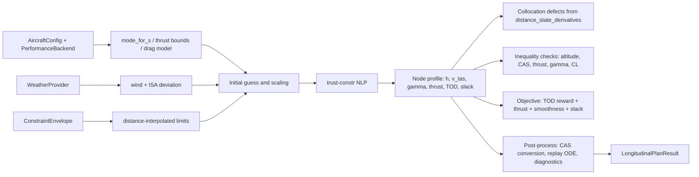

# Longitudinal Planner Walkthrough

This document explains how `src/simap/longitudinal_planner.py` turns aircraft configuration, performance data, weather, and an altitude/CAS envelope into a longitudinal descent plan.

The planner solves a distance-domain optimal-control problem on a fixed node grid. The key idea is:

- The optimizer chooses the profile shape.
- The distance-domain dynamics enforce the physics.
- The constraint envelope keeps the plan inside the allowed operating region.
- A small objective nudges the solver toward a smooth, feasible descent with low thrust and a reasonable top-of-descent.

## 1. What the planner is solving

The planner works from the runway threshold upstream.

- `s = 0` is the threshold.
- `s = TOD` is the upstream end of the planned segment.
- The solver chooses values at `num_nodes` points between those two distances.

The decision vector contains:

- `h[s_i]`: altitude at each node
- `v_tas[s_i]`: true airspeed at each node
- `gamma[s_i]`: flight path angle at each node
- `thrust[s_i]`: thrust at each node
- `TOD`: the upstream distance limit
- `slack`: one scalar feasibility slack shared by the inequality constraints

The planner enforces:

- Boundary conditions at the runway threshold and upstream boundary
- Dynamics in distance form
- Altitude, CAS, thrust, gamma, and lift-coefficient limits from the constraint envelope
- Mode-dependent aircraft limits from the aircraft configuration and performance backend

## 2. Model

The core motion model is the distance-domain state derivative implemented in `distance_state_derivatives()` in `src/simap/longitudinal_dynamics.py`.

The state used by the ODE is:

- `h(s)`: altitude
- `v_tas(s)`: true airspeed
- `t(s)`: elapsed time

The derivatives are:

- `dh/ds = -tan(gamma)`
- `dv_tas/ds = -(((thrust - drag) / mass) - g * sin(gamma)) / (v_tas * cos(gamma))`
- `dt/ds = 1 / ground_speed`

Where:

- `drag` comes from the selected performance backend
- `ground_speed = v_tas + alongtrack_wind`
- `alongtrack_wind` projects the wind vector onto the reference track

This formulation is useful because the planner is spatially parameterized:

- The grid is in meters along-track, not in time.
- Wind affects time accumulation directly through ground speed.
- Altitude and speed are coupled through the flight-path angle and energy balance.

### What is fixed and what is optimized

The planner does not integrate a full state-control ODE in the usual shooting sense. Instead:

- `h`, `v_tas`, `gamma`, and `thrust` are optimized as node variables.
- The dynamics are imposed as collocation defects between neighboring nodes.
- `t(s)` is recomputed by integrating the along-track ground speed profile after the node values are chosen.

So the continuous ODE is the physical reference, while the NLP uses a discretized version of it.

## 3. Boundary conditions

The endpoints are defined by:

- `ThresholdBoundary`
- `UpstreamBoundary`

At the threshold:

- altitude is fixed to `threshold.h_m`
- CAS is fixed to the threshold CAS converted to TAS at the threshold atmosphere
- flight-path angle is fixed to `threshold.gamma_rad`

At the upstream end:

- altitude is fixed to `upstream.h_m`
- flight-path angle is fixed to `upstream.gamma_rad`
- CAS must lie within `upstream.cas_window_mps`

The upstream distance itself is not fixed in advance. The solver can move it by changing `TOD`.

## 4. Constraints

The constraint envelope is represented by `ConstraintEnvelope`.

It provides piecewise-interpolated bounds over distance for:

- altitude lower and upper bounds
- CAS lower and upper bounds
- optional gamma lower and upper bounds
- optional thrust lower and upper bounds
- optional maximum lift coefficient

At each node, the solver checks the current distance against the envelope and enforces:

- `h_lower(s) <= h(s) <= h_upper(s)`
- `cas_lower(s) <= CAS(s) <= cas_upper(s)`
- `thrust_lower(s) <= thrust(s) <= thrust_upper(s)` when present
- `gamma_lower(s) <= gamma(s) <= gamma_upper(s)` when present
- `CL(s) <= CL_max(s)` when present

### Envelope vs aircraft-mode limits

The aircraft config changes by distance:

- `mode_for_s()` returns `clean`, `approach`, or `final`
- `planned_cas_bounds_mps()` gives the mode-dependent CAS floor and ceiling

The planner combines the envelope with these aircraft-mode limits by taking:

- the tighter lower bound
- the tighter upper bound

This means the envelope is not the only source of restrictions. The aircraft itself can tighten the feasible region.

### Slack variable

The scalar `constraint_slack` relaxes all inequality constraints in a uniform way.

In the residuals, the slack is scaled separately for:

- altitude
- speed
- flight-path angle
- thrust

The objective penalizes `constraint_slack` very heavily, so it is only used if strict feasibility is difficult or impossible.

## 5. Objective

The objective in `_objective()` is a weighted sum of four terms:

1. **Top-of-descent reward**
   - Larger `TOD` is rewarded through a negative term.
   - This nudges the solution toward a longer, later descent segment when it remains feasible.

2. **Thrust penalty**
   - The planner compares thrust against idle thrust.
   - The normalized thrust surplus is squared and averaged.
   - This discourages unnecessarily high thrust during descent.

3. **Gamma smoothness penalty**
   - The discrete gradient of `gamma` along distance is squared and averaged.
   - This encourages a smoother path angle profile.

4. **Slack penalty**
   - The scalar slack is squared and multiplied by a very large weight.
   - This strongly prefers exact feasibility.

In symbolic form, the objective is:

```text
J = -w_tod * TOD
    + w_thrust * TOD * mean(((thrust - idle) / thrust_scale)^2)
    + w_gamma * mean((d gamma / ds)^2)
    + w_slack * slack^2
```

The exact normalization constants are chosen so the terms are numerically comparable.

## 6. The ODE problem

There are two places where ODE-style integration appears.

### A. Collocation constraints inside the optimizer

The actual NLP enforces the distance-domain dynamics by trapezoidal collocation:

```text
x[i+1] - x[i] - 0.5 * ds * (f[i] + f[i+1]) = 0
```

for the state pair:

- `x = [h, v_tas]`

where `f = distance_state_derivatives(...)[:2]`.

The time state is not part of the collocation residuals. Instead, it is recomputed from the current profile with `_integrate_time_profile()`.

### B. Replay after optimization

After the solver converges, `_replay_solution()` integrates the selected profile again with `solve_ivp()`.

This replay step is a consistency check:

- it integrates the selected `h` and `v_tas` profile back through the ODE
- it compares the integrated result to the optimized node values
- it reports max errors for altitude, speed, and time

That replay is not part of the optimization itself. It is validation of the resulting plan.

## 7. Mental model for the full data flow

Think of the planner as a pipeline with four layers:

1. **Inputs define the world**
   - Aircraft config gives mass, wing area, speed limits, and mode gates.
   - Performance backend gives drag, idle thrust, and thrust bounds.
   - Weather gives wind and temperature deviation.
   - Constraint envelope gives altitude/CAS/thrust/gamma/CL limits over distance.

2. **The optimizer picks a candidate profile**
   - It chooses `h`, `v_tas`, `gamma`, `thrust`, `TOD`, and `slack` at the node grid.
   - An initial guess seeds the solver.
   - Bounds keep the search inside a reasonable numeric range.

3. **Physics and constraints score the candidate**
   - Distance-domain dynamics produce collocation defects.
   - The envelope checks feasibility at each node.
   - Time is recomputed from ground speed and wind.
   - The objective rewards a longer TOD and smooth, low-thrust descent.

4. **Post-processing turns the solution into a usable plan**
   - The solver output is unpacked into arrays.
   - TAS is converted back to CAS.
   - The plan is replayed through the ODE for verification.
   - A `LongitudinalPlanResult` is returned with both values and diagnostics.

### Diagram



## 8. Practical reading order in the code

If you want to read the implementation in the same order as the math, start here:

1. `plan_longitudinal_descent()`
2. `_initial_guess()` and `_decision_bounds()`
3. `_objective()`
4. `_equality_constraints()`
5. `_inequality_constraints()`
6. `_replay_solution()`
7. `distance_state_derivatives()` in `src/simap/longitudinal_dynamics.py`

That order matches the path from inputs, to optimization, to validation.
