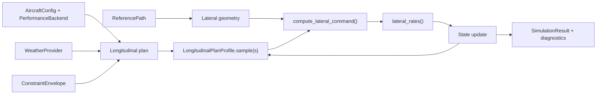

# Longitudinal Planner and Coupled Simulator Walkthrough

This document explains the SIMAP full stack end to end:

1. Build the aircraft, weather, path, and constraint inputs.
2. Solve the longitudinal descent plan in distance space.
3. Replay that plan through the coupled lateral/longitudinal simulator.
4. Inspect the resulting trajectory and diagnostics.

The important idea is that the longitudinal planner produces the path-wise
profile, while the simulator treats that profile as authoritative over
``s_m`` and uses the lateral channel to move the aircraft through the map.

## 1. End-to-end shape of the system

The full stack is a two-stage pipeline.

The planner answers:

- What altitude should the aircraft have at each distance from the threshold?
- What true airspeed, flight-path angle, and thrust are feasible there?
- Where is the top of descent upstream of the runway?

The simulator answers:

- Given that plan, can the aircraft follow the reference path laterally?
- How do wind, bank limits, and roll dynamics affect the actual track?
- What happens to the final position, cross-track error, and timing when the
  plan is replayed?

The example entry point in `src/simap/examples/run_a320_full_simulation.py`
does exactly this:

1. Load aircraft data and build `AircraftConfig`.
2. Build a `ReferencePath`.
3. Build the longitudinal `ConstraintEnvelope`.
4. Call `plan_longitudinal_descent()`.
5. Call `simulate_plan()` with the resulting plan.
6. Plot the route, cross-track error, bank response, and track error.

## 2. What the planner solves

The planner works in distance along the reference track.

- `s = 0` is the runway threshold.
- `s = TOD` is the upstream end of the planned segment.
- The solver uses a fixed node grid between those two points.

### Decision variables

At each node the optimizer chooses:

- `h[s_i]`: altitude
- `v_tas[s_i]`: true airspeed
- `gamma[s_i]`: flight-path angle
- `thrust[s_i]`: thrust
- `TOD`: the upstream boundary location
- `constraint_slack`: one shared feasibility slack

### Physical model

The planner uses the distance-domain state derivative implemented in
`distance_state_derivatives()`:

- `dh/ds = -tan(gamma)`
- `dv_tas/ds = -(((thrust - drag) / mass) - g * sin(gamma)) / (v_tas * cos(gamma))`
- `dt/ds = 1 / ground_speed`

Where:

- `drag` comes from the selected performance backend.
- `ground_speed = v_tas + alongtrack_wind`.
- `alongtrack_wind` is the weather wind projected onto the reference track.

This is the key modeling move: the planner is spatially parameterized, not
time-parameterized. Wind affects the time axis through ground speed, while the
vertical profile is expressed directly as a function of distance.

### What is optimized versus what is enforced

The planner does not shoot a full state-control ODE in the classical sense.
Instead:

- `h`, `v_tas`, `gamma`, and `thrust` are optimized as node values.
- The ODE is enforced with collocation defects between nodes.
- `t(s)` is reconstructed from the chosen profile by integrating ground speed.

So the continuous ODE is the physical reference model, while the nonlinear
programming problem is its discretized approximation.

## 3. Constraints

The planner has three layers of constraints.

### Boundary conditions

The endpoints come from `ThresholdBoundary` and `UpstreamBoundary`.

At the threshold:

- altitude is fixed to `threshold.h_m`
- CAS is fixed to the threshold CAS converted to TAS
- flight-path angle is fixed to `threshold.gamma_rad`

At the upstream boundary:

- altitude is fixed to `upstream.h_m`
- flight-path angle is fixed to `upstream.gamma_rad`
- CAS must lie inside `upstream.cas_window_mps`

The upstream distance itself is not fixed ahead of time. The optimizer can move
it by changing `TOD`.

### Distance envelope

The `ConstraintEnvelope` provides interpolated bounds over `s` for:

- altitude
- CAS
- flight-path angle
- thrust
- maximum lift coefficient

At each node the plan must stay inside those limits.

### Aircraft mode limits

The aircraft configuration changes by distance:

- `mode_for_s()` selects `clean`, `approach`, or `final`.
- `planned_cas_bounds_mps()` supplies the mode-dependent CAS limits.

The planner combines the envelope with the aircraft-mode limits by taking the
tighter bound in each direction.

### Slack

`constraint_slack` relaxes all inequality constraints uniformly.

It is penalized very heavily, so it is only used when strict feasibility is
hard or impossible.

## 4. Objective

The objective in `_objective()` is a weighted sum of four terms.

1. **Top-of-descent reward**
   - Larger `TOD` is rewarded.
   - This nudges the solver toward a later, longer descent when the constraints
     allow it.

2. **Thrust penalty**
   - Thrust is compared with idle thrust.
   - Excess thrust is squared and averaged.
   - This discourages unnecessary thrust during descent.

3. **Gamma smoothness penalty**
   - The discrete gradient of `gamma` along `s` is squared and averaged.
   - This prefers a smoother vertical path.

4. **Slack penalty**
   - `constraint_slack` is squared and multiplied by a very large weight.
   - This makes infeasibility expensive.

In compact form:

```text
J = -w_tod * TOD
    + w_thrust * TOD * mean(((thrust - idle) / thrust_scale)^2)
    + w_gamma * mean((d gamma / ds)^2)
    + w_slack * slack^2
```

## 5. The ODE problem

There are two ODE-like pieces in the planner.

### A. Collocation inside the optimizer

The optimizer enforces the distance-domain dynamics with trapezoidal
collocation:

```text
x[i+1] - x[i] - 0.5 * ds * (f[i] + f[i+1]) = 0
```

for the state pair:

- `x = [h, v_tas]`

where `f` is the first two components of
`distance_state_derivatives(...)`.

### B. Replay after the solve

After the optimizer converges, the selected profile is integrated again for
verification.

That replay checks:

- altitude consistency
- speed consistency
- time consistency

This is validation, not part of the optimization.

## 6. What the simulator does with the plan

`simulate_plan()` in `src/simap/simulator.py` is not a second planner. It is a
replay engine.

The crucial rule is:

- the longitudinal plan owns the state as a function of `s_m`
- the lateral controller owns how the aircraft moves in the map

### The data wrappers

`LongitudinalPlanProfile` wraps the optimizer result and turns it into a
sample-by-distance profile.

It validates that:

- the plan has at least two samples
- `s_m` is strictly increasing
- `t_s` is nondecreasing

It also provides `sample(s_m)`, which interpolates the plan at the current path
position.

`State` holds the simulated aircraft state:

- `t_s`
- `s_m`
- `h_m`
- `v_tas_mps`
- `east_m`
- `north_m`
- `psi_rad`
- `phi_rad`

`State.on_reference_path()` is a convenience initializer for putting the
aircraft on the path with optional cross-track or heading offsets.

### The simulation loop

Each step of `simulate_plan()` does the same sequence:

```text
sample plan at current s
compute lateral command
record outputs
advance bank and heading
advance east/north
decrease s by along-track speed
resample h and v_tas from the plan at the new s
```

The simulator keeps stepping until one of these happens:

- `s_m` reaches the threshold tolerance
- the time limit is exceeded
- the along-track speed collapses

### Why this coupling matters

The simulator does not integrate a new longitudinal ODE from scratch.

Instead, it says:

- "At this along-track position, the plan says the aircraft should be at this
  altitude and speed."
- "Given the current heading, wind, and path geometry, what bank command is
  needed to stay on track?"
- "Move the aircraft forward by the resulting along-track speed and keep
  replaying the plan."

That is the full-stack coupling in one sentence.

## 7. Lateral guidance in the replay

`compute_lateral_command()` combines geometry, wind, and phase limits.

It uses:

- the reference path tangent and normal
- the aircraft position in east/north coordinates
- the current heading and TAS
- the local wind
- the bank limit for the current aircraft mode

It returns:

- ground speed
- along-track speed
- cross-track error
- track error
- commanded curvature
- requested bank angle
- maximum allowable bank angle

`lateral_rates()` then turns that request into:

- a heading-rate command from the current bank angle
- a roll-rate command toward the requested bank

So the lateral loop is intentionally dynamic. The bank command is not applied
instantaneously; it is filtered through roll dynamics before the heading turns.

## 8. Mental model for the full data flow

Think of the system as a ribbon laid along the runway centerline.

The planner draws the ribbon vertically.

- At each distance `s`, it decides altitude, speed, thrust, and descent angle.
- The ODE and constraints keep that ribbon physically plausible.

The simulator then slides a cursor along the same ribbon.

- The cursor starts upstream at TOD.
- At each tick, the lateral controller asks how to steer the aircraft back to
  the path.
- The cursor moves forward in real space by the along-track component of the
  velocity.
- The longitudinal values are always read from the ribbon at the current `s`.

That makes the roles easy to remember:

- the planner decides *what the descent should be*
- the simulator checks *how the aircraft actually follows it*

### Data-flow diagram



## 9. Examples that make the tricky parts concrete

### Example 1: Straight path, zero wind

Suppose the reference path is straight and weather is calm.

What you should expect:

- `ground_track_rad` and path track angle stay aligned.
- `cross_track_m` stays near zero.
- `track_error_rad` stays near zero.
- `phi_req_rad` stays close to zero.
- `s_m` decreases monotonically until the threshold is reached.

This is the easiest case because the lateral channel has almost nothing to do.
The simulator mostly just replays the planned longitudinal profile.

### Example 2: Start 150 m off the centerline

The test in `tests/test_coupled_simulator.py` creates an initial state that is
150 m off the reference path.

What happens conceptually:

- the first longitudinal sample still comes from the TOD end of the plan
- the lateral controller sees a large cross-track error
- the requested bank angle points back toward the path
- the bank response lags because roll is dynamic, not instantaneous
- cross-track error shrinks over time until the aircraft re-centers

This example is useful because it shows the coupling clearly:

- the vertical plan does not change because of cross-track error
- the lateral controller changes the actual flight path in the map

### Example 3: Headwind or crosswind

Wind affects the simulator in two different places.

- In the longitudinal planner, wind affects time accumulation through
  ground speed.
- In the simulator, wind affects the lateral ground velocity used to update
  position and track error.

That means a headwind can make the aircraft take longer to walk down the same
`s` profile, while a crosswind can require a nonzero bank command even when the
heading is already close to the path tangent.

This is the main reason the code separates heading, ground track, and path
position.

## 10. Reading order in the code

If you want to trace the implementation in the same order as the data flow,
read these files and functions:

1. `plan_longitudinal_descent()` in `src/simap/longitudinal_planner.py`
2. `distance_state_derivatives()` in `src/simap/longitudinal_dynamics.py`
3. `LongitudinalPlanProfile` and `simulate_plan()` in `src/simap/simulator.py`
4. `compute_lateral_command()` in `src/simap/lateral_dynamics.py`
5. `lateral_rates()` in `src/simap/lateral_dynamics.py`
6. `ReferencePath` in `src/simap/path_geometry.py`

That order matches the actual full stack: inputs, plan, replay, lateral
control, and diagnostics.
