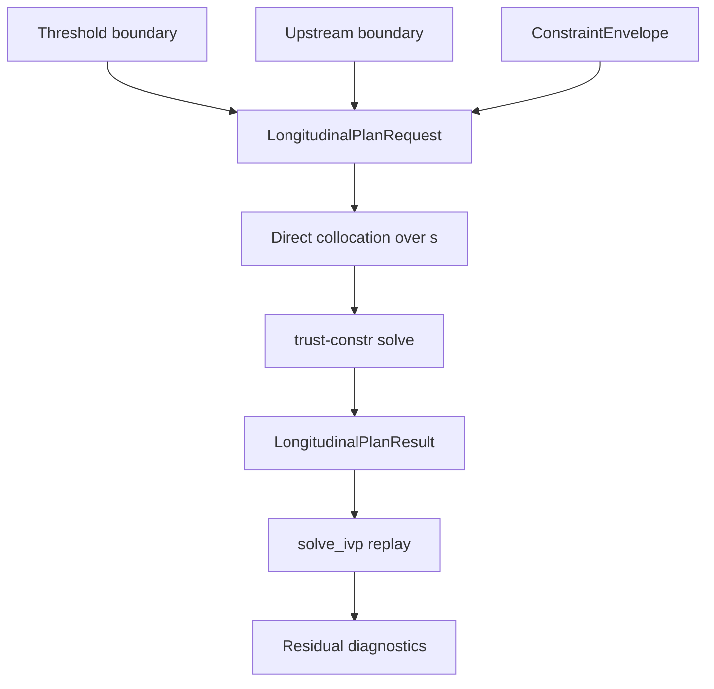

# SIMAP authoritative longitudinal planner

This document describes the longitudinal RNAV design now implemented in `simap`. The old forward-simulated glidepath tracker, feasible-CAS retrofitting pass, and coupled lateral/longitudinal rollout are no longer the authoritative surface.

## Pipeline

The planner works in **distance from threshold**:

- `s=0` is the stabilized threshold-side anchor
- `s>0` is upstream
- the optimizer solves for a free `s_TOD`

## Model

The solved state is:

- `h(s)`: altitude
- `V(s)`: TAS
- `t(s)`: accumulated distance-domain time

The controls are:

- `gamma(s)`: flight-path angle
- `T(s)`: thrust

With fixed mass, the distance-domain dynamics are:

- `dh/ds = -tan(gamma)`
- `dV/ds = -(((T-D)/m) - g sin(gamma)) / (V cos(gamma))`
- `dt/ds = 1 / V_g`

Drag uses the configuration-dependent effective polar already calibrated in `simap`, with quasi-steady lift `L ≈ m g cos(gamma)`.

## Constraints

`ConstraintEnvelope` provides nodewise lower/upper bounds over distance for:

- altitude
- CAS
- optional `gamma`
- optional thrust
- optional `CL_max`

At solve time, these are intersected with mode-based `clean / approach / final` CAS limits and the existing stall-margin floor from config.

## Request / result surface

The main entry point is [`plan_longitudinal_descent`](/Volumes/CrucialX/project-rustlingtree/src/simap/longitudinal_planner.py).

Request types:

- [`ThresholdBoundary`](/Volumes/CrucialX/project-rustlingtree/src/simap/longitudinal_planner.py)
- [`UpstreamBoundary`](/Volumes/CrucialX/project-rustlingtree/src/simap/longitudinal_planner.py)
- [`ConstraintEnvelope`](/Volumes/CrucialX/project-rustlingtree/src/simap/longitudinal_profiles.py)
- [`LongitudinalPlanRequest`](/Volumes/CrucialX/project-rustlingtree/src/simap/longitudinal_planner.py)

Result type:

- [`LongitudinalPlanResult`](/Volumes/CrucialX/project-rustlingtree/src/simap/longitudinal_planner.py)

The result includes:

- solved `s_m`, `h_m`, `v_tas_mps`, `v_cas_mps`
- `t_s`, `gamma_rad`, `thrust_n`
- mode labels
- solver success/message/status
- collocation and replay residual metrics

## Verification

After optimization, the solved controls are replayed with `solve_ivp` over the same `s` mesh. The replay residuals reported in `LongitudinalPlanResult` are the authoritative numerical check that the collocated solution still matches continuous propagation.
