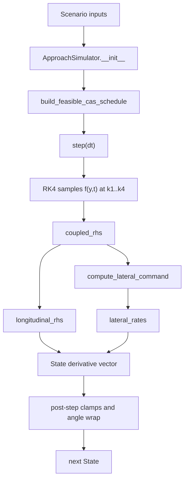

# SIMAP state-evolution walkthrough

This document traces how the coupled SIMAP simulator evolves state from one sample to the next, with emphasis on where the model is constrained, clipped, or otherwise made feasible. The main entry points are [`ApproachSimulator`](/Volumes/CrucialX/project-rustlingtree/src/simap/simulator.py#L319), the coupled right-hand side in [`coupled_rhs`](/Volumes/CrucialX/project-rustlingtree/src/simap/simulator.py#L209), the longitudinal command law in [`longitudinal_command`](/Volumes/CrucialX/project-rustlingtree/src/simap/longitudinal_dynamics.py#L31), and the lateral guidance law in [`compute_lateral_command`](/Volumes/CrucialX/project-rustlingtree/src/simap/lateral_dynamics.py#L67).

## Pipeline at a glance

The simulator keeps two parallel views of the aircraft:

- the dynamic state, which is integrated every step, and
- the guidance / feasibility schedules, which are computed from profiles and cached once during construction.

## State and coordinate conventions

The simulator state is defined in [`State`](/Volumes/CrucialX/project-rustlingtree/src/simap/simulator.py#L28). The relevant fields are:

- `t_s`: simulation time in seconds
- `s_m`: along-track distance to the runway threshold
- `h_m`: altitude in meters
- `v_tas_mps`: true airspeed
- `east_m`, `north_m`: local Cartesian position
- `psi_rad`: heading
- `phi_rad`: bank angle

Two conventions are easy to miss:

- `s_m` decreases as the aircraft progresses toward the runway threshold. The longitudinal model uses that sign convention directly in `longitudinal_command` and `longitudinal_rhs` ([`longitudinal_dynamics.py:31`](/Volumes/CrucialX/project-rustlingtree/src/simap/longitudinal_dynamics.py#L31), [`longitudinal_dynamics.py:165`](/Volumes/CrucialX/project-rustlingtree/src/simap/longitudinal_dynamics.py#L165)).
- Latitude / longitude are derived from the local north/east state for logging only. They are not fed back into the dynamics. The conversion happens in [`ReferencePath.latlon_from_ne`](/Volumes/CrucialX/project-rustlingtree/src/simap/path_geometry.py#L172) and is sampled in [`ApproachSimulator.run`](/Volumes/CrucialX/project-rustlingtree/src/simap/simulator.py#L556).

The angle helper [`wrap_angle_rad`](/Volumes/CrucialX/project-rustlingtree/src/simap/lateral_dynamics.py#L13) is used to keep heading, track error, and post-step heading inside `[-pi, pi]`.

## Construction phase

The constructor [`ApproachSimulator.__init__`](/Volumes/CrucialX/project-rustlingtree/src/simap/simulator.py#L319) does one important thing before any simulation starts: it precomputes a feasible calibrated-airspeed schedule with [`build_feasible_cas_schedule`](/Volumes/CrucialX/project-rustlingtree/src/simap/longitudinal_profiles.py#L132).

That matters because the runtime longitudinal law never uses the raw requested schedule directly. It always uses the cached feasible profile stored in `self.feasible_speed_schedule_cas`, both in the integrator and in the logged trajectory. If the output speed differs from the raw plan, this is the first place to check.

### Mode selection

The aircraft phase is selected by [`mode_for_s`](/Volumes/CrucialX/project-rustlingtree/src/simap/config.py#L47):

- `s_m <= final_gate_m` -> `final`
- `s_m <= approach_gate_m` -> `approach`
- otherwise -> `clean`

Because `s_m` decreases toward the runway, the phase changes happen as the aircraft gets closer to the threshold. The selected mode affects:

- CAS min/max limits
- altitude-rate limits
- speed time constant
- bank comfort and procedure limits
- roll-rate limit
- stall-based bank limiting
- drag polar coefficients

## Feasible speed schedule

The feasibility pass is built in [`build_feasible_cas_schedule`](/Volumes/CrucialX/project-rustlingtree/src/simap/longitudinal_profiles.py#L132). The algorithm is conservative and one-directional:

1. Build a distance grid with `_build_distance_grid`.
2. Clamp the raw CAS schedule to mode limits at each grid point.
3. Convert CAS to TAS using the planned ISA deviation.
4. March upstream from lower `s_m` to higher `s_m`.
5. At each step, limit the upstream TAS by the deceleration that is physically available from the previous feasible point.
6. Convert the result back to CAS and clamp again to mode limits.

Important details:

- The grid must have a positive `distance_step_m`; `_build_distance_grid` rejects non-positive values ([`longitudinal_profiles.py:122`](/Volumes/CrucialX/project-rustlingtree/src/simap/longitudinal_profiles.py#L122)).
- The profile is endpoint-clamped by `ScalarProfile.value`, so values outside the sampled range freeze at the nearest endpoint ([`longitudinal_profiles.py:40`](/Volumes/CrucialX/project-rustlingtree/src/simap/longitudinal_profiles.py#L40)).
- The schedule is planned with `planning_tailwind_mps` and `planning_delta_isa_K`, not the live weather. This is deliberate. It means runtime weather can differ from the planning assumptions without invalidating the cached schedule.

The result is another `ScalarProfile`, but now it represents the feasible CAS schedule used online.

## One RK4 step

`ApproachSimulator.step` integrates the coupled state with classical RK4 ([`simulator.py:369`](/Volumes/CrucialX/project-rustlingtree/src/simap/simulator.py#L369)).

The order is:

1. Pack the current state into a NumPy vector.
2. Evaluate the coupled RHS at `k1`, `k2`, `k3`, and `k4`.
3. Combine them with RK4 weights.
4. Apply post-step clamps.

The RK4 sub-evaluations are not clamped individually. Only the final state is clamped. That means large `dt_s` values can produce sub-step states that temporarily wander negative or outside the nominal domain even if the final state is projected back into bounds.

The post-step clamps are:

- `s_m = max(0.0, s_m)`
- `h_m = max(0.0, h_m)`
- `v_tas_mps = max(1.0, v_tas_mps)`
- `psi_rad = wrap_angle_rad(psi_rad)`

There is no similar clamp on `phi_rad` after integration.

## Coupled RHS

[`coupled_rhs`](/Volumes/CrucialX/project-rustlingtree/src/simap/simulator.py#L209) is the heart of the coupled model. It returns the derivative vector in this order:

1. `s_dot`
2. `h_dot`
3. `v_tas_dot`
4. `east_dot`
5. `north_dot`
6. `psi_dot`
7. `phi_dot`

The sequence is easy to trace in code:

- select the phase with `mode_for_s`
- compute lateral guidance with `compute_lateral_command`
- convert lateral along-track speed to `s_dot`
- compute longitudinal rates with `longitudinal_rhs`
- compute bank and heading rates with `lateral_rates`
- return the concatenated derivative vector

The coupled model uses the lateral result to drive the longitudinal result. In particular, `s_dot_mps` passed to the longitudinal law is `-command.alongtrack_speed_mps`, so path progress comes from the lateral ground-motion projection rather than from an independent longitudinal estimate.

## Lateral guidance

[`compute_lateral_command`](/Volumes/CrucialX/project-rustlingtree/src/simap/lateral_dynamics.py#L67) computes the instantaneous path-following request.

### Step 1: build the ground velocity

The function converts heading and wind into earth-fixed velocity:

- `east_dot = v_tas * cos(psi) + wind_east`
- `north_dot = v_tas * sin(psi) + wind_north`

Then it computes:

- `ground_speed = hypot(east_dot, north_dot)`
- `ground_track = atan2(north_dot, east_dot)` wrapped to `[-pi, pi]`

The weather sample is taken from the current state and time through `weather.wind_ne_mps` and `weather.delta_isa_K` ([`weather.py:9`](/Volumes/CrucialX/project-rustlingtree/src/simap/weather.py#L9)).

### Step 2: compare the aircraft to the path

The reference path is interpolated at `s_m`:

- `position_ne(s_m)`
- `tangent_hat(s_m)`
- `normal_hat(s_m)`
- `track_angle_rad(s_m)`
- `curvature(s_m)`

These values come from [`ReferencePath`](/Volumes/CrucialX/project-rustlingtree/src/simap/path_geometry.py#L16). The path helper has its own constraints:

- waypoints must be one-dimensional, ordered, and unique
- there must be at least two waypoints
- path samples must have consistent lengths
- `s_from_start_m` must be strictly increasing
- `s_m` must be strictly decreasing

The path constructor also behaves differently depending on waypoint count:

- for exactly two waypoints, it uses linear interpolation and effectively zero curvature
- for three or more waypoints, it builds spline-based geometry and derives track and curvature from spline derivatives

That means lateral behavior can change materially if the path is re-sampled or if the waypoint count changes, because `curvature_cmd_inv_m` starts from the path curvature itself.

The aircraft-path error terms are:

- `cross_track_m = dot([east-ref_east, north-ref_north], normal_hat)`
- `track_error_rad = wrap(ground_track - ref_track)`

One subtle limit lives here: `alongtrack_speed_mps` is computed as the projection of ground velocity onto the path tangent, then floored at `0.0`. If the aircraft is moving backward along the path tangent, the simulator does not allow negative along-track progress. It simply stops path advancement at zero.

### Step 3: shape the curvature request

The commanded curvature is:

`ref_curvature + feedback`

where the feedback term is:

`-(cross_track_gain * cross_track / lookahead^2) - (track_error_gain * track_error / lookahead)`

The lookahead is floored at `1.0 m`, which prevents division by zero and limits extreme gains when the configured lookahead is very small.

The requested bank angle is then derived from coordinated-turn geometry:

`phi_req = atan(ground_speed^2 * curvature_cmd / g)`

To avoid blow-up near zero airspeed or zero ground speed, the code uses `max(ground_speed, 1.0)` in that calculation.

### Step 4: apply bank limits

The bank request is clipped by [`bank_limit_rad`](/Volumes/CrucialX/project-rustlingtree/src/simap/config.py#L78), which takes the minimum of:

- `mode.phi_comfort_max_rad`
- `mode.phi_procedure_max_rad`
- the stall-based bank limit from `bank_limit_stall_rad`

The stall limit itself is zero when CAS is non-positive. Otherwise it uses a stall-speed estimate scaled by aircraft mass and then converts the remaining margin into a bank limit.

This is the main lateral feasibility gate. If you see the model under-turning, look here first. If `phi_max_rad` is unexpectedly small, the likely causes are:

- speed is low
- mode-specific procedure or comfort limit is tight
- stall margin factor is restrictive

## Roll and heading rates

[`lateral_rates`](/Volumes/CrucialX/project-rustlingtree/src/simap/lateral_dynamics.py#L183) converts the requested bank into roll and heading rates.

The roll loop is a first-order lag:

`phi_dot = clip((phi_req - phi) / tau_phi, +/- p_max)`

The heading rate is then computed from the current bank, not the requested bank:

`psi_dot = g * tan(phi) / max(v_tas, 1.0)`

This is a major nuance. Heading response lags behind the guidance request until the bank angle itself catches up. If a trajectory looks slow to turn, the first thing to inspect is whether the roll loop is saturated or whether `phi_req` is clipped before it ever reaches the roll model.

## Longitudinal command and RHS

[`longitudinal_command`](/Volumes/CrucialX/project-rustlingtree/src/simap/longitudinal_dynamics.py#L31) computes the speed and vertical command. [`longitudinal_rhs`](/Volumes/CrucialX/project-rustlingtree/src/simap/longitudinal_dynamics.py#L85) then turns that command into the derivative array used by the integrator.

### Step 1: protect the speed state

`v_tas_mps` is floored at `1.0 m/s` before any atmosphere or drag calculations. That avoids divide-by-zero and stabilizes the performance model.

### Step 2: determine `s_dot`

If `s_dot_mps` is not supplied, the function estimates along-track progress from TAS plus along-track wind:

- project wind onto the track with `alongtrack_wind_mps`
- compute `gs_along = max(1.0, v_tas + wind_along)`
- set `s_dot = -gs_along`

The coupled simulator always supplies `s_dot_mps`, so this fallback is only used when the longitudinal model is called standalone. In the coupled pipeline, lateral motion determines path progress.

### Step 3: command altitude rate

The altitude law is a glidepath feed-forward plus proportional correction:

`hdot_ff = altitude_profile.slope(s_m) * s_dot`

`hdot_cmd = hdot_ff + k_h_sinv * (h_ref - h)`

Then it is clipped to the active mode's vertical-speed limits:

- lower bound: `mode.vs_min_mps`
- upper bound: `mode.vs_max_mps`

The sign convention is worth checking if altitude looks inverted. Because `s_m` decreases toward the threshold, a positive altitude slope combined with negative `s_dot` produces descent.

The altitude profile itself is a `ScalarProfile`, so:

- it requires strictly increasing sample coordinates
- values are endpoint-clamped
- slopes are piecewise constant between nodes

### Step 4: command speed

The requested CAS is read from the schedule, then clamped to the mode's CAS limits with [`clamp_cas_to_mode_limits`](/Volumes/CrucialX/project-rustlingtree/src/simap/config.py#L55).

That clamped CAS is converted to TAS at the current altitude and ISA deviation, and the speed command is a first-order lag:

`vdot_cmd = (v_ref_tas - v_tas) / tau_v`

The actual speed derivative is then limited by:

- the available deceleration budget, and
- the positive acceleration ceiling `cfg.a_acc_max_mps2`

So the final applied acceleration is:

`vdot = clip(vdot_cmd, -a_dec_max, a_acc_max_mps2)`

### Step 5: compute the deceleration budget

[`longitudinal_deceleration_limit_mps2`](/Volumes/CrucialX/project-rustlingtree/src/simap/longitudinal_profiles.py#L57) centralizes the deceleration limit. It calls the performance backend for:

- drag, via `drag_newtons`
- idle thrust, via `idle_thrust_newtons`

The net budget is:

`(drag - idle_thrust) / mass - g * abs(sin(gamma_ref))`

and it is floored at `0.0`.

The `abs(sin(gamma_ref))` term is conservative. It subtracts the longitudinal gravity component by magnitude, so it does not matter whether the path segment is nominally up or down. If the budget seems too small, look here and at the backend drag model.

### Backend guardrails

The backend used in this repository, [`EffectivePolarBackend`](/Volumes/CrucialX/project-rustlingtree/src/simap/backends.py#L35), has its own internal clamps:

- `v_tas_mps` is floored at `1.0`
- `sin_gamma` is clipped to `[-0.95, 0.95]`
- `cos(bank)` is clipped to at least `0.1`

Those guardrails matter because the deceleration limit is only as realistic as the backend drag and thrust estimates. If speed feasibility looks suspicious, the backend is part of the search space, not just the schedule planner.

## Where limits are imposed

| Layer | What is limited | Where it happens | Why it matters |
|---|---|---|---|
| Path geometry | waypoint validity, interpolation domain, endpoint access | [`ReferencePath.__post_init__`](/Volumes/CrucialX/project-rustlingtree/src/simap/path_geometry.py#L31), [`ReferencePath._interp_for_s`](/Volumes/CrucialX/project-rustlingtree/src/simap/path_geometry.py#L148) | Bad geometry fails early; out-of-range path queries freeze at endpoints |
| Scalar profiles | profile shape and interpolation domain | [`ScalarProfile.__post_init__`](/Volumes/CrucialX/project-rustlingtree/src/simap/longitudinal_profiles.py#L26), [`ScalarProfile.value`](/Volumes/CrucialX/project-rustlingtree/src/simap/longitudinal_profiles.py#L40) | Altitude and speed profiles are not extrapolated |
| Phase selection | clean / approach / final thresholds | [`mode_for_s`](/Volumes/CrucialX/project-rustlingtree/src/simap/config.py#L47) | Many downstream limits change at these gates |
| CAS schedule | mode CAS min/max, feasible decel, planning assumptions | [`clamp_cas_to_mode_limits`](/Volumes/CrucialX/project-rustlingtree/src/simap/config.py#L55), [`build_feasible_cas_schedule`](/Volumes/CrucialX/project-rustlingtree/src/simap/longitudinal_profiles.py#L132) | The simulator does not follow the raw speed plan directly |
| Bank request | comfort limit, procedure limit, stall limit | [`bank_limit_rad`](/Volumes/CrucialX/project-rustlingtree/src/simap/config.py#L78) | Prevents impossible or undesired turns |
| Roll dynamics | roll-rate magnitude | [`lateral_rates`](/Volumes/CrucialX/project-rustlingtree/src/simap/lateral_dynamics.py#L183) | Heading can lag bank request significantly |
| Vertical speed | climb/descent rate | [`longitudinal_command`](/Volumes/CrucialX/project-rustlingtree/src/simap/longitudinal_dynamics.py#L54) | Glidepath tracking cannot demand arbitrary `hdot` |
| Speed acceleration | decel budget and positive accel ceiling | [`longitudinal_command`](/Volumes/CrucialX/project-rustlingtree/src/simap/longitudinal_dynamics.py#L64) | Prevents physically impossible slowdown or speed-up |
| RK4 result | nonnegative `s_m`, `h_m`, `v_tas_mps`, wrapped heading | [`ApproachSimulator.step`](/Volumes/CrucialX/project-rustlingtree/src/simap/simulator.py#L369) | Final state is kept numerically sane after integration |
| Run loop | termination at `t_max_s` or `s_m <= 1.0` | [`ApproachSimulator.run`](/Volumes/CrucialX/project-rustlingtree/src/simap/simulator.py#L453) | Stops the rollout before or at the threshold |

## What to check when results deviate

If the simulation does not match expectation, the fastest debug path is usually:

1. Check the mode gate first. A phase change at the wrong `s_m` changes both the speed schedule and the bank limits.
2. Check the cached feasible CAS schedule. The runtime never follows the raw requested schedule directly.
3. Check whether `phi_req_rad` is clipped. A small `phi_max_rad` often explains weak turns.
4. Check whether `phi_dot` is saturated. If the roll model cannot catch up, heading will lag.
5. Check whether `vdot` is clipped by the deceleration budget or the positive acceleration ceiling.
6. Check the sign convention on `s_m`. Many apparent "backwards" bugs reduce to interpreting the path coordinate in the wrong direction.
7. Check `dt_s`. There is no adaptive step control, and only the final RK4 output is clamped.

Two especially common sources of confusion:

- The logged trajectory stores `v_ref_cas_mps` from the feasible schedule, not the raw requested schedule.
- `lat_deg` / `lon_deg` are outputs derived from local coordinates. They do not participate in the dynamics, so a geometry bug can coexist with apparently reasonable `s_m`, `h_m`, or speed traces.

## Minimal reference map

- [`simulator.py:Scenario, State, Trajectory`](/Volumes/CrucialX/project-rustlingtree/src/simap/simulator.py#L18)
- [`simulator.py:coupled_rhs`](/Volumes/CrucialX/project-rustlingtree/src/simap/simulator.py#L209)
- [`simulator.py:ApproachSimulator.step`](/Volumes/CrucialX/project-rustlingtree/src/simap/simulator.py#L369)
- [`simulator.py:ApproachSimulator.run`](/Volumes/CrucialX/project-rustlingtree/src/simap/simulator.py#L453)
- [`longitudinal_dynamics.py:longitudinal_command`](/Volumes/CrucialX/project-rustlingtree/src/simap/longitudinal_dynamics.py#L31)
- [`longitudinal_dynamics.py:longitudinal_rhs`](/Volumes/CrucialX/project-rustlingtree/src/simap/longitudinal_dynamics.py#L85)
- [`lateral_dynamics.py:compute_lateral_command`](/Volumes/CrucialX/project-rustlingtree/src/simap/lateral_dynamics.py#L67)
- [`lateral_dynamics.py:lateral_rates`](/Volumes/CrucialX/project-rustlingtree/src/simap/lateral_dynamics.py#L183)
- [`longitudinal_profiles.py:build_feasible_cas_schedule`](/Volumes/CrucialX/project-rustlingtree/src/simap/longitudinal_profiles.py#L132)
- [`config.py:mode_for_s, clamp_cas_to_mode_limits, bank_limit_rad`](/Volumes/CrucialX/project-rustlingtree/src/simap/config.py#L47)

